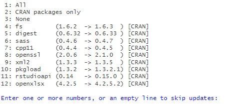

# :package: Package `tabloid` 

## Description

Faire des tableaux facilement pour explorer des données, soit pour être réexportés et retravaillés en Calc ou Excel, soit pour être insérés directement dans un Rmd

Inclure les marges (et marges intermédiaires éventuelles) aux tableaux

## Auteurs

Laurette Cretin, Insee, PSAR de Toulouse au moment du développement

Maëlle Fontaine, Insee, SED de Nantes au moment du développement

## Ambition

Servir à différents chargés d'études

## Comment devenir utilisateur ou contributeur

### 1 - utiliser le package

#### Installation

L'instruction d'installation est la suivante :

```         
# install.packages("remotes")
remotes::install_git("https://gitlab.insee.fr/espace-charges-etudes/boite-outils/tableaux",
                     dependencies = TRUE)
                     
```

Important : avec l'argument `dependencies = TRUE`, R va chercher s'il existe des mises à jour de packages dont dépend le package `tabloid` pour fonctionner - si c'est le cas, il demande à l'utilisateur ce qu'il doit faire (installer ou non ces mises à jour).

Dans l'exemple ci-dessous, plusieurs versions de packages installées sur notre poste sont antérieures aux versions disponibles sur le CRAN. Renseigner alors l'option choisie :

-   1 : installer toutes les mises à jour
-   2 : installer uniquement les mises à jour des packages du CRAN
-   3 : aucune mise à jour
-   le ou les numéros des packages de la liste dont on souhaite la mise à jour
-   ligne vide : aucune mise à jour



#### Utilisation

Le chargement du package se fait comme d'habitude avec cette instruction :

```         
library(tabloid)
```

L'ensemble des fonctions du package est alors accessible à l'utilisateur.
L'aide des fonctions est disponible [ici](http://espace-charges-etudes.gitlab-pages.insee.fr/boite-outils/tableaux/reference/index.html).


#### Nouveautés

Le package étant encore en développement, il est recommandé de régulièrement vérifier si des mises-à-jour ont été faites sur le répertoire, et d'installer une nouvelle version.
Pour ré-installer le package, il se peut que l'installation échoue sur AUS avec l'un des messages suivants :


- `package ‘tabloid’ is in use and will not be installed`
- `ERROR: cannot remove earlier installation, is it in use?`

Dans ce cas, exécuter la commande `remove.packages("tabloid")` puis lancer l'installation. 


Pour suivre les nouveautés du package : c'est par [ici](https://gitlab.insee.fr/espace-charges-etudes/boite-outils/tableaux/-/blob/main/NEWS.md) :point_left: :newspaper:

### 2 - contribuer au développement du package

Pour l'instant, il vaut mieux cloner le dépôt comme n'importe quel projet Gitlab et exécuter le code suivant :

```         
library(devtools)
devtools::load_all()
devtools::document()
```

Attention, cf DESCRIPTION pour savoir quelles versions du package sont requises (en particulier, il faut des versions récentes de dplyr et tidyr)

Se référer aux vignettes et à l'aide des fonctions pour savoir comment utiliser les fonctions proposées.

Il est possible également d'ouvrir des issues sur [cette page](https://gitlab.insee.fr/espace-charges-etudes/boite-outils/tableaux/-/issues) pour signaler un bug ou proposer de nouvelles fonctionanlités.

