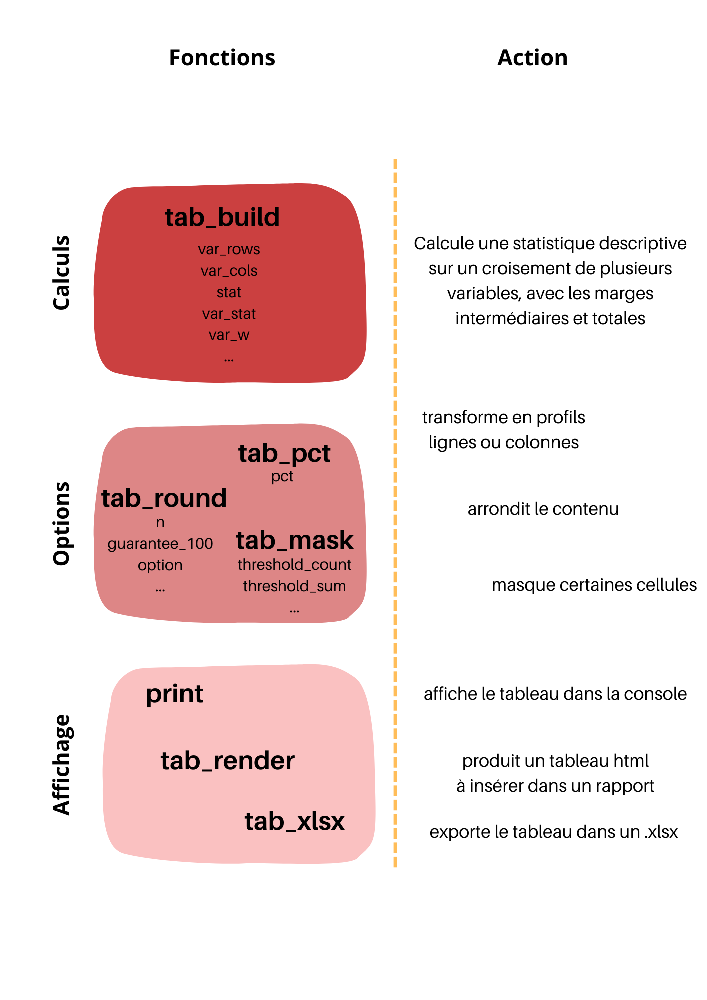

```{r, include = FALSE}
knitr::opts_chunk$set(
  collapse = TRUE,
  comment = "#>",
  eval = FALSE,
  warning = FALSE,
  message = FALSE,
  error = FALSE
)
options(rmarkdown.html_vignette.check_title = FALSE)
library(dplyr)
library(tabloid)
```

## Description rapide

Le package `tabloid` vise à faciliter la réalisation de tableaux croisés de statistiques descriptives.
Il est conçu pour des besoins usuels des chargés d'études à l'Insee.

Il propose une syntaxe unique pour la plupart des statistiques usuelles, et peut s'enchaîner avec des `%>%` ou des `|>`, à la suite par exemple d'instructions en `dplyr`.

Les tableaux croisés produits peuvent être réutilisés : 

- soit via l'export en .xlsx, 
- soit via la génération d'un tableau en html, pour insertion dans un .Rmd ou .qmd.

## Fonctions principales

Toutes les fonctions du package `tabloid` démarrent par le préfixe : **"tab_"**. Elles sont conçues pour s'enchainer les unes après les autres.

### Construire un tableau croisé : `tab_build()`

La fonction principale pour l'utilisateur est `tab_build()`.

Elle prend en paramètres une data.frame, les noms des variables à mettre en lignes et en colonnes, la variable d'intérêt et la statistique à calculer : "mean", "median", "min", "max", "count", "sum", "quantile", "weighted_mean", et "weighted_sum."
Elle peut éventuellement prendre en paramètre une variable de pondération et des seuils, pour les quantiles.

La plus-value de cette fonction est de calculer automatiquement les marges intermédiaires, pour faciliter les analyses.

`tab_build()` est le constructeur d'un objet de type tab.
Cet objet contient différents éléments qui pourront éventuellement être modifiés selon les appels ultérieurs des fonctions `tab_pct()`, `tab_round()` ou `tab_mask()`.

### Customiser le contenu : `tab_pct()`, `tab_round()`, `tab_mask()`.

Pour une customisation des tableaux ainsi construits, trois fonctions sont proposées :

-   `tab_pct()` permet, lorsque la statistique calculée est un comptage ou une somme, de transformer le tableau en un pourcentage ligne ou colonne.

-   `tab_round()` permet d'arrondir les données des cellules et éventuellement de gérer la cohérence des sommes à 100 % pour les pourcentages lignes et colonnes, en proposant différentes règles de décision.

-   `tab_mask()` permet de blanchir les cellules concernant trop peu d'observations, ou de masquer les lignes ou colonnes correspondant aux totaux.

Toutes ces fonctions prennent en entrée un objet tab et rendent un autre objet tab transformé : elles peuvent donc s'enchaîner, dans l'ordre souhaité.

### Afficher ou réutiliser le tableau : `print()`, `tab_render()`, `tab_xlsx()`

Enfin, pour l'affichage des tableaux, trois possibilités :

-   la fonction générique `print()` permet d'afficher le tableau dans la console par exemple ;

-   la fonction `tab_render()` fabrique un objet html (kableExtra) mis en forme, par exemple pour être inséré directement dans un rapport md.
    C'est la solution préconisée pour la reproductibilité des analyses ;

-   la fonction `tab_xlsx()` qui permet d'exporter le tableau mis en forme dans un fichier .xlsx, de manière à pouvoir l'envoyer à quelqu'un ou à le retravailler, sous Calc par exemple.
    Ce n'est pas la solution préconisée pour la reproductibilité des analyses, mais cela convient à beaucoup de cas de figures à l'Insee.

Ces fonctions prennent en entrée un objet tab et rendent un objet de type différent.
Elles doivent prendre place à la fin d'une série d'instructions et ne peuvent pas s'enchaîner entre elles.

### Récapitulatif



Les vignettes suivantes présentent plus en détail l'utilisation des différentes fonctions :

-   [tab_build() : construire un tableau croisé](http://espace-charges-etudes.gitlab-pages.insee.fr/boite-outils/tableaux/articles/bb_creer_tableau_croise.html)
-   [tab_pct() : calculer un profil ligne ou colonne](http://espace-charges-etudes.gitlab-pages.insee.fr/boite-outils/tableaux/articles/cc_calculer_profil_ligne_colonne.html)
-   [tab_round() : gérer les arrondis d'un tableau croisé](http://espace-charges-etudes.gitlab-pages.insee.fr/boite-outils/tableaux/articles/dd_arrondir_tableau.html)
-   [tab_mask() : masquer une partie du contenu d'un tableau](http://espace-charges-etudes.gitlab-pages.insee.fr/boite-outils/tableaux/articles/ee_masquer_partie_contenu_tableau.html)
-   [tab_render() : afficher un tableau mis en forme](http://espace-charges-etudes.gitlab-pages.insee.fr/boite-outils/tableaux/articles/ff_afficher_joli_tableau_html.html)
-   [tab_xlsx() : exporter un tableau dans un classeur xlsx](http://espace-charges-etudes.gitlab-pages.insee.fr/boite-outils/tableaux/articles/gg_exporter_joli_tableau_xlsx.html)
