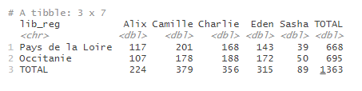

```{r, include = FALSE}
knitr::opts_chunk$set(
  collapse = TRUE,
  comment = "#>",
  eval = FALSE,
  warning = FALSE,
  message = FALSE,
  error = FALSE
)
options(rmarkdown.html_vignette.check_title = FALSE)
library(dplyr)
library(tabloid)
```

## Description rapide 

`tab_build()` est la fonction principale à connaître du package `tabloid` : elle permet de calculer une statistique pour plusieurs croisements de variables, en intégrant automatiquement les différentes marges.

Elle prend en paramètres une data.frame contenant les données, les noms des variables à mettre en lignes et en colonnes, la variable d'intérêt et la statistique à calculer.
Elle peut éventuellement prendre en paramètre une variable de pondération et un seuil pour le calcul d'un quantile précis.

La plus-value de cette fonction est surtout de calculer automatiquement les marges intermédiaires, pour faciliter les analyses.

`tab_build()` est le constructeur d'un objet de type tab : cet objet contient différents éléments qui pourront éventuellement être modifiés selon les appels ultérieurs des fonctions `tab_pct()`, `tab_round()` ou `tab_mask()`.

## Utilisation de la fonction

### Construction du tableau
#### Variables en lignes et colonnes

La structure du tableau sera donnée par les variables qualitatives listées dans `var_rows` (pour les lignes) et `var_cols` (pour les colonnes).
Ces variables doivent être de type character ou factor.

Les noms des variables sont à renseigner sans quote.
Il est possible de renseigner plusieurs variables, en les assemblant avec c().
La fonction peut gérer 0 à n variables en lignes et 0 à 2 variables en colonnes.
Il est conseillé de ne pas dépasser 2 variables en lignes pour des raisons de lisibilité.
Les marges seront calculées automatiquement.

#### Statistique demandée et variable d'intérêt

Le coeur du tableau sera constitué du calcul d'une statistique usuelle (`stat`) sur une variable d'intérêt (`var_stat`).

Le paramètre `stat` précise la statistique à calculer.
Il peut prendre les valeurs suivantes :

-   "mean" : moyenne

-   "median" : médiane

-   "count" : effectifs

-   "sum" : somme

-   "min", "max" : minimum, maximum

-   "quantile" : quantile

-   "weighted_mean" : moyenne pondérée

-   "weighted_sum": somme pondérée

Le paramètre `var_stat` indique sur quelle variable doit porter le calcul à effectuer.
Il doit s'agir d'une variable présente dans la table de données.
Ce paramètre est à renseigner sans quote.

#### Exemple :

La table des prénoms contient, pour chaque département, chaque prénom et chaque sexe, le nombre de naissances pour chaque année de 1900 à 2020.
On crée pour l'exemple une table réduite contenant les données 2020 pour deux régions et un ensemble de prénoms mixtes.

```{r donnees, include = TRUE}
library(tabloid)
library(dplyr)

prenoms_mixtes <- prenoms |>
  filter(annais == "2020" &
           prenom %in% c("Charlie", "Alix", "Eden", "Sasha", "Camille") &
           lib_reg %in% c("Occitanie", "Pays de la Loire"))
```


On souhaite connaitre le nombre de naissances, pour chaque prénom, dans l'ensemble de ces deux régions.
On peut renseigner ainsi la fonction `tab_build()` :

- var_rows : la variable `prenom` dont les modalités donneront les lignes du tableau final
- var_stat : la variable `nombre` dont on veut connaitre la somme pour chaque modalité de `prenom`
- stat : la statistique à calculer sur la variable `nombre`, ici une somme (`"sum"`)

```{r ex_1r0c, include = TRUE}
prenoms_mixtes |> 
  tab_build(var_rows = prenom, 
            var_stat = nombre,
            stat = "sum")
```


Pour connaitre la répartition des naissances dans chacune des deux régions, on peut croiser la variable `prenom` avec la variable `lib_reg` contenant les libellés de région. On renseigne, par exemple, une variable en ligne et l'autre en colonne :

```{r ex_1r1c, include = TRUE}
prenoms_mixtes |> 
  tab_build(var_rows = lib_reg, 
            var_cols = prenom,
            var_stat = nombre,
            stat = "sum")
```


Pour ajouter le détail par département, on renseigne une deuxième variable dans le paramètre `var_rows`, de la façon suivante :

```{r ex_2r1c, include = TRUE}
prenoms_mixtes |> 
  tab_build(var_rows = c(lib_reg, lib_dpt),
            var_cols = prenom,
            var_stat = nombre,
            stat = "sum")
```


De la même façon, il est possible d'ajouter une deuxième variable en colonne, pour avoir le détail des naissances par prénom et par sexe :

```{r ex_2r2c, include = TRUE}
prenoms_mixtes |> 
  tab_build(var_rows = c(lib_reg, lib_dpt),
            var_cols = c(prenom, sexe),
            var_stat = nombre,
            stat = "sum")
```


> Remarque : si les variables utilisées pour définir les lignes et les colonnes sont de type character, l'ordre des modalités de ces variables dans le tableau sera celui d'apparition dans la table de données.
Pour éviter ce comportement prédéfini et personnaliser l'ordre des modalités dans le tableau en sortie, l'utilisateur peut au préalable convertir la variable en facteur avec la fonction `factor()`, en précisant l'ordre des niveaux avec le paramètre `levels`, comme dans les exemples ci-dessous.

```{r ex_factor, include=TRUE}
# recodage de la variable région, pour que les lignes Occitanie apparaissent en premier 

prenoms_mixtes |> 
  mutate(lib_reg = factor(lib_reg, levels = c("Occitanie", "Pays de la Loire"))) |> 
  tab_build(var_rows = c(lib_reg, lib_dpt),
            var_cols = prenom,
            var_stat = nombre,
            stat = "sum")
```


```{r ex_factor2, include=TRUE}
# recodage de la variable prenom, pour modifier l'ordre des colonnes

prenoms_mixtes |> 
  mutate(prenom = factor(prenom, levels = c("Camille", "Charlie", "Eden", "Alix", "Sasha"))) |> 
  tab_build(var_rows = c(lib_reg, lib_dpt),
            var_cols = prenom,
            var_stat = nombre,
            stat = "sum")
```


#### Récapitulatif


### Options : lab_total, var_w, probs

#### Modifier l'intitulé des totaux

Le paramètre `lab_total` permet de modifier l'intitulé des lignes ou colonnes correspondant aux différents totaux et sous-totaux.
Il vaut par défaut "Ensemble" ; on peut le modifier en renseignant une chaîne de caractères.

```{r ex_lab_total, include = TRUE}
prenoms_mixtes |> 
  tab_build(var_rows = lib_reg, 
            var_cols = prenom,
            var_stat = nombre,
            stat = "sum",
            lab_total = "TOTAL")
```



#### Calculs pondérés

Le paramètre `var_w` permet d'indiquer, si besoin, la variable de pondération à utiliser pour calculer une somme pondérée ou une moyenne pondérée (stat = "weighted_sum" ou stat = "weighted_mean"). 
Il doit s'agir d'une variable présente dans la table de données.
Ce paramètre est à renseigner sans quote.

#### Calcul de quantile

Le paramètre `probs` correspond au seuil du quantile à calculer, pour stat = "quantile".
Il sera calculé par interpolation linéaire.
Ce seuil doit être compris entre 0 et 1 ; par exemple, pour calculer le 7ème décile, on écrira `probs = 0.7`.

<!-- ### Visualisation rapide d'un objet de type tab -->

<!-- Les fonctions génériques `print()`, `head()` et `tail()` permettent à un utilisateur de visualiser rapidement un objet de type tab. -->

<!-- <!-- La fonction `arrange()` permet de trier un objet de type tab selon les variables de son choix. --> -->

<!-- --- -->
<!-- Pour information : structure d'un objet tab -->
<!-- --- -->

<!-- La fonction `tab_build()` retourne un objet de type tab. -->
<!-- Si on enregistre le résultat dans un objet, on peut observer qu'il s'agit d'une liste. -->

<!-- ```{r ex_structure_tab, include = TRUE} -->
<!-- my_tab <- prenoms_mixtes |>  -->
<!--   tab_build(var_rows = lib_reg,  -->
<!--             var_cols = prenom, -->
<!--             var_stat = nombre, -->
<!--             stat = "sum", -->
<!--             lab_total = "TOTAL") -->
<!-- ``` -->

<!--  -->

<!-- Pour visualiser cet objet sans fioriture, il suffit de l'afficher dans la console, en indiquant simplement le nom de l'objet ou en utilisant la fonction générique `print()`, comme dans l'exemple ci-dessous. -->


<!-- ```{r ex_print, include = TRUE} -->

<!-- print(my_tab)  -->

<!-- # équivalent à my_tab seul -->
<!-- my_tab -->

<!-- ``` -->

<!--  -->

<!-- Un utilisateur qui ouvrira l'objet tab depuis l'environnement s'apercevra que l'objet tab est en réalité de structure plus complexe : il s'agit d'une liste qui contient un argument principal : `core`, et des arguments supplémentaires qui conservent des informations nécessaires pour les fonctions de customisation. -->

<!-- En particulier, il contient : -->

<!-- -   `core_last`, le résultat complet du dernier calcul courant ; -->
<!-- -   `core_init`, le résultat complet issu de l'exécution initiale de tab_build ; -->
<!-- -   `core`, le résultat qui sera à afficher, et qui intègre les arrondis ou masquage ; -->
<!-- -   `count`, qui intègre les comptages, utiles au moment du masquage ; -->
<!-- -   `state`, qui porte l'information de la dernière fonction de customisation à être passée sur l'objet ; -->
<!-- -   `param`, qui contient les paramètres saisis par l'utilisateur au moment de l'exécution de `tab_build()`. -->


## Liens vers les autres vignettes

Les vignettes suivantes présentent plus en détail l'utilisation des différentes fonctions :

-   [tab_pct() : calculer un profil ligne ou colonne](http://espace-charges-etudes.gitlab-pages.insee.fr/boite-outils/tableaux/articles/cc_calculer_profil_ligne_colonne.html)
-   [tab_round() : gérer les arrondis d'un tableau croisé](http://espace-charges-etudes.gitlab-pages.insee.fr/boite-outils/tableaux/articles/dd_arrondir_tableau.html)
-   [tab_mask() : masquer une partie du contenu d'un tableau](http://espace-charges-etudes.gitlab-pages.insee.fr/boite-outils/tableaux/articles/ee_masquer_partie_contenu_tableau.html)
-   [tab_render() : afficher un tableau mis en forme](http://espace-charges-etudes.gitlab-pages.insee.fr/boite-outils/tableaux/articles/ff_afficher_joli_tableau_html.html)
-   [tab_xlsx() : exporter un tableau dans un classeur xlsx](http://espace-charges-etudes.gitlab-pages.insee.fr/boite-outils/tableaux/articles/gg_exporter_joli_tableau_xlsx.html)

