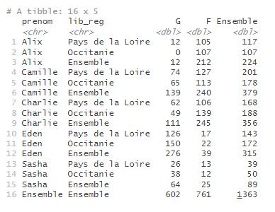
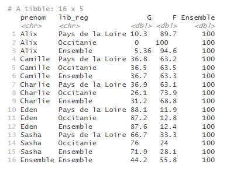

```{r, include = FALSE}
knitr::opts_chunk$set(
  collapse = TRUE,
  comment = "#>",
  eval = FALSE,
  warning = FALSE,
  message = FALSE,
  error = FALSE
)
options(rmarkdown.html_vignette.check_title = FALSE)
library(dplyr)
library(tabloid)
```

## Description rapide 

`tab_pct()` est une des fonctions de customisation du contenu d'un tableau proposée par le package `tabloid`.

Elle permet, lorsque la statistique calculée est un comptage (effectifs) ou une somme, de transformer le tableau en un pourcentage ligne ou colonne.

Elle prend en entrée un objet tab et retourne un autre objet tab transformé. Elle s'utilise forcément juste après une instruction `tab_build()`. Elle peut éventuellement être suivi des autres fonctions de customisation `tab_round()` ou `tab_mask()`.


## Utilisation de la fonction


### pourcentage ligne ou colonne : `pct`

Le paramètre `pct` peut prendre les valeurs suivantes :

- **"col"** pour calculer un pourcentage colonne
- **"row"** pour calculer un pourcentage ligne


### Exemple

Le tableau suivant donne le nombre de naissances en 2020, selon le sexe, pour chacun des cinq prénoms mixtes retenus dans les deux régions.

```{r pct_col, include=TRUE}
prenoms_mixtes |> 
  tab_build(var_rows = c(prenom, lib_reg), 
            var_cols = sexe, 
            var_stat = nombre, 
            stat = "sum")
```



Pour connaitre la répartition en pourcentage, on utilise la fonction `tab_pct()`, en précisant 'pct = "row"' pour indiquer que l'on souhaite des pourcentages en lignes

```{r pct_col2, include=TRUE}
prenoms_mixtes |> 
  tab_build(var_rows = c(prenom, lib_reg), 
            var_cols = sexe, 
            var_stat = nombre, 
            stat = "sum") |> 
  tab_pct(pct = "row")
```




### Conseils d'utilisation

La fonction `tab_pct()` n'a de sens que lorsque les calculs portent sur des effectifs ou des sommes (éventuellement pondérés)  - on ne peut donc l'utiliser que pour stat = "count", "sum" ou "weighted_sum".

---
Remarque : l'appel à cette fonction modifie les attributs `core` et `core_last` de l'objet tab, mais pas `core_init`.
---

Dans le cas des profils lignes ou colonnes, l'option `guarantee_100 = TRUE` de la fonction `tab_round()` est proposée si l'utilisateur a besoin d'assurer une cohérence d'arrondis (pour un nombre de décimales n donné). Cela est en général imposé par la charte éditoriale des publications de l'Insee. Pour plus d'informations sur cette option, se référer à l'article suivant : [Gérer les arrondis d'un tableau croisé](http://espace-charges-etudes.gitlab-pages.insee.fr/boite-outils/tableaux/articles/dd_arrondir_tableau.html).


## Liens vers les autres vignettes

Les vignettes suivantes présentent plus en détail l'utilisation des différentes fonctions :

-   [tab_build() : construire un tableau croisé](http://espace-charges-etudes.gitlab-pages.insee.fr/boite-outils/tableaux/articles/bb_creer_tableau_croise.html)
-   [tab_round() : gérer les arrondis d'un tableau croisé](http://espace-charges-etudes.gitlab-pages.insee.fr/boite-outils/tableaux/articles/dd_arrondir_tableau.html)
-   [tab_mask() : masquer une partie du contenu d'un tableau](http://espace-charges-etudes.gitlab-pages.insee.fr/boite-outils/tableaux/articles/ee_masquer_partie_contenu_tableau.html)
-   [tab_render() : afficher un tableau mis en forme](http://espace-charges-etudes.gitlab-pages.insee.fr/boite-outils/tableaux/articles/ff_afficher_joli_tableau_html.html)
-   [tab_xlsx() : exporter un tableau dans un classeur xlsx](http://espace-charges-etudes.gitlab-pages.insee.fr/boite-outils/tableaux/articles/gg_exporter_joli_tableau_xlsx.html)

