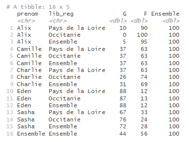
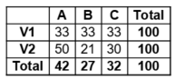
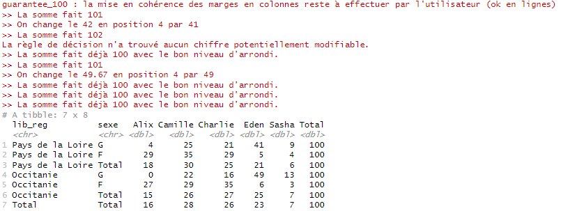

```{r, include = FALSE}
knitr::opts_chunk$set(
  collapse = TRUE,
  comment = "#>",
  eval = FALSE,
  warning = FALSE,
  message = FALSE,
  error = FALSE
)
options(rmarkdown.html_vignette.check_title = FALSE)
library(dplyr)
library(tabloid)
```


## Description rapide

`tab_round()` est une des fonctions de customisation du contenu d'un tableau proposée par le package `tabloid`.

Elle permet d'arrondir les données des cellules et éventuellement de gérer la cohérence des sommes à 100 % pour les pourcentages lignes et colonnes, en proposant différentes règles de décision.

Elle prend en entrée un objet tab et rendent un autre objet tab transformé. Elle doit prendre place après une instruction `tab_build()` (et éventuellement `tab_pct()`), mais peut intervenir avant ou après la fonction `tab_mask()`.

## Utilisation de la fonction

### Arrondir à un certain nombre de décimales ou à la dizaine, centaine, etc.

Le paramètre `n` de la fonction `tab_round()` permet de préciser le nombre de décimales pour l'arrondi. Par défaut, il est à 0.

```{r ex_round, include=TRUE}
prenoms_mixtes |> 
  tab_build(var_rows = c(prenom, lib_reg), 
            var_cols = sexe, 
            var_stat = nombre, 
            stat = "sum") |> 
  tab_pct(pct = "row") |> 
  tab_round()
```




Le paramètre `n` doit être un entier.
Il est possible de renseigner des entiers négatifs, pour arrondir à la dizaine, à la centaine, etc. Par exemple, pour arrondir à la centaine, on renseignera `n = -2`.

### Garantir la cohérence d'une somme de pourcentages à 100 %

#### Pourquoi faire ça ?
Cette fonctionnalité peut surprendre les plus orthodoxes. Elle est en fait assez spécifique à une règle éditoriale de l'Insee qui impose qu'une série arrondie à n décimales est sensée sommer à 100 % à n décimales. Ainsi, il n'est pas possible de diffuser le tableau ci-dessous, puisque la somme des pourcentages de la première ligne fait 99 et que celle de chacune des deux lignes suivantes fait 101.



L'option proposée consiste à sacrifier un chiffre pour rétablir la somme à 100 %. La plupart du temps, il s'agit de faire un +1 ou un -1 (dans le cas où n = 0) quelque part. Dans certains cas, 2 chiffres de la série doivent être modifiés, si la somme vaut 98 ou 102. Si plus de deux chiffres doivent être modifiés, l'option ne peut pas s'appliquer et un message en avertit l'utilisateur. Ce cas peut arriver si le nombre de modalités est trop grand avec beaucoup de petites valeurs : dans ce cas, il est conseillé à l'utilisateur de regrouper des modalités.

Afin de savoir quel(s) chiffre(s) modifier, deux règles de décision sont proposées à l'utilisateur. Dans tous les cas, la fonction revient aux valeurs non arrondies des chiffres. L'option s'appliquera à toutes les lignes (respectivement colonnes) de manière indépendante, si c'est un pourcentage ligne (resp. colonne).

#### Option 1 : `lowest_lie`
Comme son nom l'indique, option = "lowest_lie" va choisir le(s) chiffre(s) à modifier en minimisant le "mensonge" réalisé, au sens du poids de l'erreur introduite par rapport au chiffre initial lui-même. Par exemple, dans la deuxième ligne du tableau ci-dessus, si la série "50 - 21 - 30" est en réalité : "49.7 - 20.5 - 29.8", il est moins inexact de modifier le 49.7 en 49 (le -0.7 ne représente que 1.4 % du chiffre initial) que le 20.5 en 20 (le -0.5 représenterait 2.4 % du chiffre initial), ou a fortiori le 29.8 en 29 (2.7 %). La série modifiée sera donc : "49 - 21 - 30".

Attention, cette option conduit plus souvent à modifier le chiffre le plus grand de la série.

#### Option 2 : `closest`
Comme son nom l'indique, option = "closest" va choisir le(s) chiffre(s) à modifier comme étant les plus proches, au sens de la valeur absolue de l'erreur introduite. Dans le même exemple de la deuxième ligne du tableau ci-dessus, si la série "50 - 21 - 30" est en réalité : "49.7 - 20.5 - 29.8", faire un -1 impliquerait introduire une erreur de 0.7 sur le premier chiffre, 0.5 sur le deuxième et 0.8 sur le troisième. La série modifiée sera donc : "50 - 20 - 30".

Attention, cette option peut conduire à modifier fortement des très petites valeurs, et notamment des 1 en 0 (pour n = 0).

#### Option `verbose`
L'option verbose = TRUE permet d'en dire plus à l'utilisateur dans la console sur les règles de décision appliquées et les chiffres modifiés. Cela peut être utile pour garder un oeil sur le nombre de chiffres modifiés (trop de modifications peuvent suggérer à l'utilisateur de regrouper des modalités), mais aussi pour vérifier que les chiffres phare commentés dans une publication ne sont pas modifiés.

#### Remarques diverses

- Sur le fond, cette pratique est discutable. Cette fonctionnalité est néanmoins proposée pour harmoniser les façons de faire et faciliter la possibilité de les exécuter de façon automatique sur un grand nombre de séries.

- Attention, contrairement à une idée parfois répandue, ces cas ne se raréfient pas lorsque l'on augmente le nombre de décimales !

- Cette fonctionnalité a le parti pris de ne pas modifier de plus de plus de 10^n une valeur (autrement dit, il ne sera jamais possible de modifier un 49.5, normalement arrondi 50, en 48 ou en 51). Si la règle de décision appliquée conduit à cela en théorie, le message d'erreur suivant s'affiche : "La règle de décision n'a trouvé aucun chiffre potentiellement modifiable. ", et la série ne respectera pas la somme à 100 %. Cela n'impacte pas les traitements des autres lignes ou colonnes du tableau.

- Cette fonctionnalité ne gère pas les marges colonnes pour un pourcentage ligne, ou les marges lignes pour un pourcentage colonnes. Cette mise en cohérence reste à effectuer par l'utilisateur.

- Les calculs liés à la fonction tab_round s'exécutent indépendamment de la fonction tab_mask. Aussi, il est possible que des chiffres fassent l'objet d'une modification par l'option guarante_100 = TRUE, mais soient finalement masqués.

- Contrairement à l'arrondi dit "à la moitié paire" utilisé par défaut de R ("une fois au-dessus, une fois en-dessous"), on utilise ici l'arrondi classique où, par exemple, 0.5 est arrondi à 1.

### Exemple

```{r ex_round2, include=TRUE}
prenoms_mixtes |>
 tab_build(var_rows = c(lib_reg, sexe),
           var_cols = prenom,
           var_stat = nombre,
           lab_total = "Total",
           stat = "sum") |>
 tab_pct(pct = "row") |>
 tab_round(n = 0,
           guarantee_100 = TRUE,
           option = "lowest_lie",
           verbose = TRUE)
```



## Liens vers les autres vignettes

Les vignettes suivantes présentent plus en détail l'utilisation des différentes fonctions :

-   [tab_build() : construire un tableau croisé](http://espace-charges-etudes.gitlab-pages.insee.fr/boite-outils/tableaux/articles/bb_creer_tableau_croise.html)
-   [tab_pct() : calculer un profil ligne ou colonne](http://espace-charges-etudes.gitlab-pages.insee.fr/boite-outils/tableaux/articles/cc_calculer_profil_ligne_colonne.html)
-   [tab_mask() : masquer une partie du contenu d'un tableau](http://espace-charges-etudes.gitlab-pages.insee.fr/boite-outils/tableaux/articles/ee_masquer_partie_contenu_tableau.html)
-   [tab_render() : afficher un tableau mis en forme](http://espace-charges-etudes.gitlab-pages.insee.fr/boite-outils/tableaux/articles/ff_afficher_joli_tableau_html.html)
-   [tab_xlsx() : exporter un tableau dans un classeur xlsx](http://espace-charges-etudes.gitlab-pages.insee.fr/boite-outils/tableaux/articles/gg_exporter_joli_tableau_xlsx.html)

