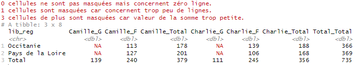
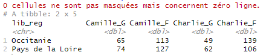

```{r, include = FALSE}
knitr::opts_chunk$set(
  collapse = TRUE,
  comment = "#>",
  eval = FALSE,
  warning = FALSE,
  message = FALSE,
  error = FALSE
)
options(rmarkdown.html_vignette.check_title = FALSE)
library(dplyr)
library(tabloid)
```

## Description rapide

`tab_mask()` est une des fonctions de customisation du contenu d'un tableau proposée par le package `tabloid`.

Elle permet de blanchir les cellules concernant trop peu d'observations, ou de masquer les lignes ou colonnes correspondant aux totaux.

Elle prend en entrée un objet tab et rendent un autre objet tab transformé. Elle doit prendre place après une instruction `tab_build()` (et éventuellement `tab_pct()`), mais peut intervenir avant ou après la fonction `tab_round()`.

## Utilisation de la fonction

### Masquer des cellules dans le coeur du tableau

Remarque : les cellules qui prennent une valeur nulle car elles ne concernent aucune ligne de la table de données initiale, ne sont jamais masquées.

#### threshold_count

Cette fonctionnalité remplacera certaines cellules par des `NA` lorsque le nombre de lignes sous-jacent dans la table de données initiale est strictement inférieur à l'entier `threshold_count` (autrement dit, seuil de comptage).

Attention, la bonne utilisation de cette fonction demande parfois de bien connaître la structure de sa table initiale (à quoi correspond une ligne). Cf exemple 1 plus bas.

---
Remarque : cette option fait appel à l'attribut count de l'objet tab, qui a été calculé à l'intérieur de la fonction `tab_build()`. Cette façon de faire n'est pas très économe mais elle permet de ne pas avoir à revenir à la table de données initiale au moment d'appeler cette fonction.
---

#### threshold_sum
 
Ce paramètre n'a de sens que pour stat = "sum", qu'un pourcentage ligne ou colonne ait ou non été calculé par la suite.

Cette fonctionnalité remplacera certaines cellules par des `NA` lorsque la valeur sous-jacente de la cellule (qui est une somme) est strictement inférieure à la valeur `threshold_sum` (autrement dit, seuil de somme).

Si l'utilisateur renseigne ce paramètre sans que la statistique demandée dans `tab_build()` soit une somme, une erreur sera renvoyée à l'utilisateur.

### Masquer des marges

Pour rappel, la fonction `tab_build()` calcule d'office les marges, intermédiaires et totales.

Or, dans certains cas, l'utilisateur peut ne pas avoir envie de considérer ces marges, c'est-à-dire les lignes ou colonnes correspondant aux totaux, intermédiaires ou non. Par exemple, si on a fait un filtre sur la table initiale pour ne représenter les données que de certaines régions, cet ensemble n'a pas de signification en tant que tel.

Dans ce cas, l'utilisateur peut demander à supprimer les lignes afférentes (`mask_total = "rows"`), les colonnes afférentes (`mask_total = "cols"`) ou les deux (`mask_total = c("rows", "cols")`).

Ces options ne permettent pas de masquer une partie seulement des marges, par exemple les marges intermédiaires et pas les marges totales, ou inversement. Pour ce type de besoin plus spécifique, il est conseillé d'exporter le tableau via la fonction `tab_xlsx()` et de le retravailler via un tableur.

---
Remarque : cette fonction modifie l'attribut core du tableau (à afficher), mais ne touche pas à l'attribut core_last, qui garde l'information du calcul total.
---

### Articulation des différentes options

Toutes les options de la fonction peuvent s'utiliser seules ou combinées.

L'option `verbose = TRUE` permet à l'utilisateur de savoir combien de cellules ont été masquées, pour `threshold_count` d'une part et pour `threshold_sum` d'autre part. Cette option est à TRUE par défaut.

Attention cependant, les messages indiqués par cette option dénombre l'ensemble des cellules masquées, marges comprises, même si celles-ci sont masquées ensuite.


### Exemples

#### Exemple 1

Le code ci-dessous compte le nombre de naissances d'enfants prénommés Charlie ou Camille en 2020, par sexe, pour deux régions, et demande à masquer les cellules pour lesquelles, soit le prénom est donné dans moins de 5 départements (threshold_count = 5, sachant que dans la table initiale une ligne correspond à un croisement annais * prenom * sexe * département), soit le prénom est donné moins de 100 fois en tout (threshold_sum = 100 sachant que l'on a demandé de calculer une somme de la variable "nombre").

```{r ex_mask, include=TRUE}
prenoms_mixtes |>
 filter(prenom %in% c("Charlie", "Camille")) |>
 tab_build(var_rows = lib_reg,
           var_cols = c(prenom, sexe),
           var_stat = nombre,
           lab_total = "Total",
           stat = "sum") |>
 tab_mask(threshold_count = 5,
          threshold_sum = 100)
```


#### Exemple 2

Le code ci-dessous compte le nombre de naissances d'enfants prénommés Charlie ou Camille en 2020, par sexe, pour deux régions, et demande à masquer les marges lignes et colonnes. En effet, l'utilisateur a pu souhaiter faire ces comptages pour un besoin particulier, mais les ensembles {Pays de la Loire + Occitanie} ou {Charlie + Camille} n'ont pas de significations en tant que tels et nuiraient à la pertinence du tableau.

```{r ex_mask2, include=TRUE}
prenoms_mixtes |>
 filter(prenom %in% c("Charlie", "Camille")) |>
 tab_build(var_rows = lib_reg,
           var_cols = c(prenom, sexe),
           var_stat = nombre,
           lab_total = "Total",
           stat = "sum") |>
  tab_mask(mask_total = c("rows", "cols"),
           verbose = TRUE)
```



## Liens vers les autres vignettes

Les vignettes suivantes présentent plus en détail l'utilisation des différentes fonctions :

-   [tab_build() : construire un tableau croisé](http://espace-charges-etudes.gitlab-pages.insee.fr/boite-outils/tableaux/articles/bb_creer_tableau_croise.html)
-   [tab_pct() : calculer un profil ligne ou colonne](http://espace-charges-etudes.gitlab-pages.insee.fr/boite-outils/tableaux/articles/cc_calculer_profil_ligne_colonne.html)
-   [tab_round() : gérer les arrondis d'un tableau croisé](http://espace-charges-etudes.gitlab-pages.insee.fr/boite-outils/tableaux/articles/dd_arrondir_tableau.html)
-   [tab_render() : afficher un tableau mis en forme](http://espace-charges-etudes.gitlab-pages.insee.fr/boite-outils/tableaux/articles/ff_afficher_joli_tableau_html.html)
-   [tab_xlsx() : exporter un tableau dans un classeur xlsx](http://espace-charges-etudes.gitlab-pages.insee.fr/boite-outils/tableaux/articles/gg_exporter_joli_tableau_xlsx.html)

