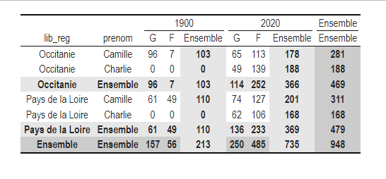
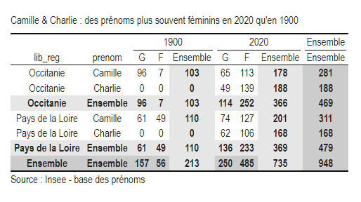
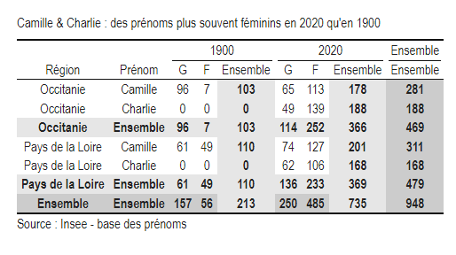
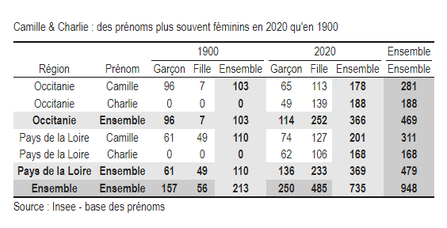

```{r, include = FALSE}
knitr::opts_chunk$set(
  collapse = TRUE,
  comment = "#>",
  eval = FALSE,
  warning = FALSE,
  message = FALSE,
  error = FALSE
)
options(rmarkdown.html_vignette.check_title = FALSE)
library(dplyr)
library(tabloid)
```

## Description rapide

La fonction `tab_render()` met en forme un tableau, pouvant par exemple être inséré directement dans un rapport md. C'est la solution préconisée pour la reproductibilité des analyses.

Elle prend en entrée un objet tab et affiche un objet html dans le Viewer de RStudio. Elle fait appel au package `kableExtra`. Elle s'utilise après une instruction `tab_build()`, et doit intervenir en dernier, après toutes les fonctions de customisation éventuelles (`tab_pct()`, `tab_round()` ou `tab_mask()`).

<!-- L'utilisateur peut choisir entre `tab_render()` ou `tab_xlsx()`, selon sa préférence ou son cas de figure. -->


## Utilisation de la fonction

### Exporter le tableau au format html

La fonction `tab_render()` peut s'utiliser simplement, sans aucun paramètre. Elle retourne alors le tableau tel qu'il a été construit au format html.

```{r ex_render, include=TRUE}
library(dplyr)

prenoms_mixtes_2 <- prenoms |>
  filter(prenom %in% c("Charlie", "Camille") & 
           lib_reg %in% c("Occitanie", "Pays de la Loire") & 
           annais %in% c("1900", "2020"))

prenoms_mixtes_2 |>
  tab_build(var_rows = c(lib_reg, prenom),
            var_cols = c(annais, sexe),
            var_stat = nombre,
            stat = "sum") |> 
  tab_render()
```





### Mettre en forme le tableau

#### Titre et note

Les paramètres `title` et `note` de la fonction permettent d'ajouter un titre ou une note de bas de page au tableau. 

```{r ex_title, include=TRUE}
prenoms_mixtes_2 |>
  tab_build(var_rows = c(lib_reg, prenom),
            var_cols = c(annais, sexe),
            var_stat = nombre,
            stat = "sum") |> 
  tab_render(title = "Camille & Charlie : des prénoms plus souvent féminins en 2020 qu'en 1900",
             note = "Source : Insee - base des prénoms")
```



#### Modification des libellés

Pour personnaliser les intitulés des colonnes, deux paramètres permettent de modifier les libellés, selon s'il s'agit des libellés des variables lignes ou colonnes.

- `lab_rows` permet de modifier les intitulés des variables en ligne. On renseigne les nouveaux libellés à utiliser pour le tableau dans un vecteur de caractères.

On peut ainsi remplacer les libellés "lib_reg" et "prenom" par les intitulés correspondant "Région" et "Prénom" de la façon suivante :

```{r ex_lab_rows, include=TRUE}
prenoms_mixtes_2 |>
  tab_build(var_rows = c(lib_reg, prenom),
            var_cols = c(annais, sexe),
            var_stat = nombre,
            stat = "sum") |> 
  tab_render(title = "Camille & Charlie : des prénoms plus souvent féminins en 2020 qu'en 1900",
             note = "Source : Insee - base des prénoms",
             lab_rows = c("Région", "Prénom"))
```



- `lab_cols` permet de modifier les libellés des intitulés des variables colonnes. Ce paramètre est à renseigner sous forme de liste. Chaque élément de la liste permet de préciser la variable concernée, et les nouveaux libellés des différentes modalités.

Dans l'exemple, on souhaite modifier uniquement les libellés de la variable "sexe", pour remplacer les modalités "G/F" par "Garçon/Fille". 

```{r ex_lab_cols, include=TRUE}
prenoms_mixtes_2 |>
  tab_build(var_rows = c(lib_reg, prenom),
            var_cols = c(annais, sexe),
            var_stat = nombre,
            stat = "sum") |> 
  tab_render(title = "Camille & Charlie : des prénoms plus souvent féminins en 2020 qu'en 1900",
             note = "Source : Insee - base des prénoms",
             lab_rows = c("Région", "Prénom"),
             lab_cols = list(sexe = c("Garçon", "Fille")))
```



## Liens vers les autres vignettes

Les vignettes suivantes présentent plus en détail l'utilisation des différentes fonctions :

-   [tab_build() : construire un tableau croisé](http://espace-charges-etudes.gitlab-pages.insee.fr/boite-outils/tableaux/articles/bb_creer_tableau_croise.html)
-   [tab_pct() : calculer un profil ligne ou colonne](http://espace-charges-etudes.gitlab-pages.insee.fr/boite-outils/tableaux/articles/cc_calculer_profil_ligne_colonne.html)
-   [tab_round() : gérer les arrondis d'un tableau croisé](http://espace-charges-etudes.gitlab-pages.insee.fr/boite-outils/tableaux/articles/dd_arrondir_tableau.html)
-   [tab_mask() : masquer une partie du contenu d'un tableau](http://espace-charges-etudes.gitlab-pages.insee.fr/boite-outils/tableaux/articles/ee_masquer_partie_contenu_tableau.html)
-   [tab_xlsx() : exporter un tableau dans un classeur xlsx](http://espace-charges-etudes.gitlab-pages.insee.fr/boite-outils/tableaux/articles/gg_exporter_joli_tableau_xlsx.html)

