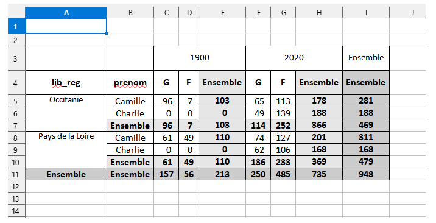
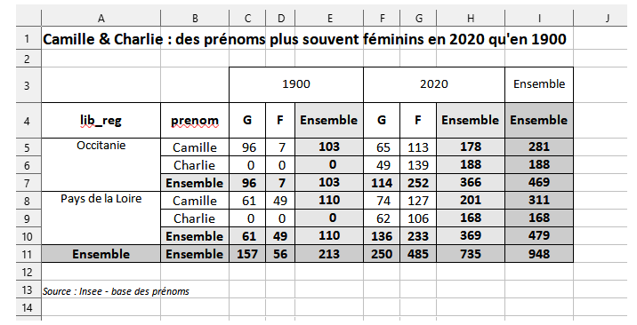
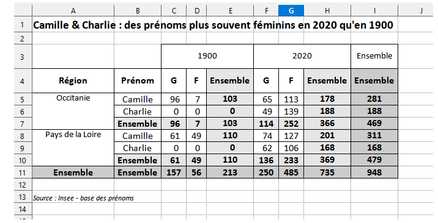
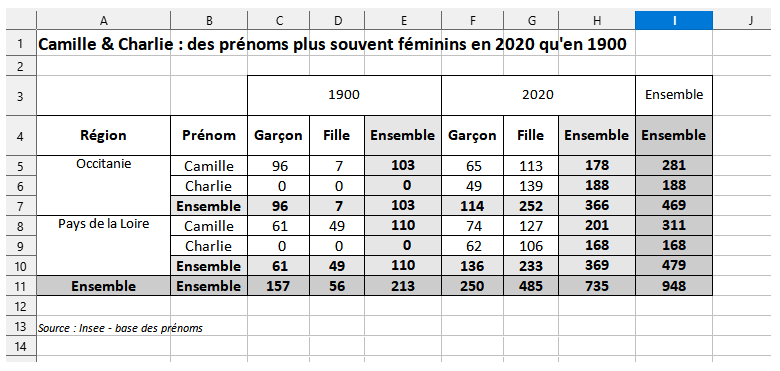

```{r, include = FALSE}
knitr::opts_chunk$set(
  collapse = TRUE,
  comment = "#>",
  eval = FALSE,
  warning = FALSE,
  message = FALSE,
  error = FALSE
)
options(rmarkdown.html_vignette.check_title = FALSE)
library(dplyr)
library(tabloid)
```

## Description rapide

La fonction `tab_xlsx()` permet d'exporter le tableau mis en forme dans un fichier .xlsx, de manière à pouvoir l'envoyer à quelqu'un ou à le retravailler, sous Calc par exemple. Ce n'est pas la solution préconisée pour la reproductibilité des analyses, mais cela convient à beaucoup de cas de figures à l'Insee.

Elle prend en entrée un objet tab et l'exporte un fichier .xlsx dont le nom et le chemin sont donnés par l'utilisateur. Elle fait appel au package `open_xlsx`. Elle s'utilise après une instruction `tab_build()`, et doit intervenir en dernier, après toutes les fonctions de customisation éventuelles (`tab_pct()`, `tab_round()` ou `tab_mask()`).

<!-- L'utilisateur doit choisir entre `tab_render` ou `tab_xlsx`, selon sa préférence ou son cas de figure. -->

## Utilisation de la fonction

### Exporter le tableau au format xlsx

#### Chemin du fichier et nom de l'onglet

Pour exporter un tableau dans un classeur excel, il est nécessaire de renseigner le chemin du fichier, ainsi que le nom de l'onglet dans lequel exporter le tableau.

- on indique dans le paramètre `path` le chemin du fichier dans lequel exporter les résultats. Il faut indiquer le nom complet du chemin, ainsi que l'extension ".xlsx". Si le dossier dans lequel on souhaite enregistrer le classeur n'existe pas, il est créé automatiquement. 
- le paramètre `sheet` permet de renseigner le nom de l'onglet dans lequel est exporté le tableau. Si le classeur existe déjà, un nouvel onglet est ajouté. 


> ! Attention : si un onglet existe déjà avec le même nom dans le classeur, le contenu est remplacé : cela permet de mettre à jour le contenu d'un onglet (en cas de correction). Pour ne pas écraser l'onglet existant, il est important de choisir un autre nom.


```{r ex_xlsx, include=TRUE}
prenoms_mixtes_2 |>
  tab_build(var_rows = c(lib_reg, prenom),
            var_cols = c(annais, sexe),
            var_stat = nombre,
            stat = "sum") |> 
  tab_xlsx(path = "Z:/donnees_prenoms/resultats_prenoms.xlsx", 
           sheet = "comp_1900_2020")
```



#### Mise à jour du contenu du fichier

- le paramètre `update` permet de préciser si on souhaite mettre à jour le fichier .xlsx. S'il est à `FALSE`, le fichier ne sera pas mis à jour : la fonction vérifie alors qu'aucun onglet ne portant déjà le même nom que celui renseigné n'existe dans le classeur. Dans le cas contraire, un message d'erreur indique à l'utilisateur de modifier le nom d'onglet choisi.

- le paramètre `open_wb` permet d'ouvrir automatiquement le fichier excel créé ou non.


### Mettre en forme le tableau

#### Titre et note

De la même façon que pour la fonction [tab_render()](http://espace-charges-etudes.gitlab-pages.insee.fr/boite-outils/tableaux/articles/ff_afficher_joli_tableau_html.htm), les paramètres `title` et `note` de la fonction permettent d'ajouter un titre ou une note de bas de page au tableau. 

```{r ex_xlsx_title, include=TRUE}
prenoms_mixtes_2 |>
  tab_build(var_rows = c(lib_reg, prenom),
            var_cols = c(annais, sexe),
            var_stat = nombre,
            stat = "sum") |> 
  tab_xlsx(path = "Z:/donnees_prenoms/resultats_prenoms.xlsx", 
           sheet = "comp_1900_2020",
           title = "Camille & Charlie : des prénoms plus souvent féminins en 2020 qu'en 1900",
             note = "Source : Insee - base des prénoms")
```



#### Modification des libellés

Les intitulés des lignes et des colonnes se modifient également de la même façon que pour la fonction [tab_render()](http://espace-charges-etudes.gitlab-pages.insee.fr/boite-outils/tableaux/articles/ff_afficher_joli_tableau_html.htm).


- `lab_rows` permet de modifier les intitulés des variables en ligne. On renseigne les nouveaux libellés à utiliser pour le tableau dans un vecteur de caractères.

On peut ainsi remplacer les libellés "lib_reg" et "prenom" par les intitulés correspondant "Région" et "Prénom" de la façon suivante :

```{r ex_xlsx_lab_rows, include=TRUE}
prenoms_mixtes_2 |>
  tab_build(var_rows = c(lib_reg, prenom),
            var_cols = c(annais, sexe),
            var_stat = nombre,
            stat = "sum") |> 
   tab_xlsx(path = "Z:/donnees_prenoms/resultats_prenoms.xlsx", 
            sheet = "comp_1900_2020",
            title = "Camille & Charlie : des prénoms plus souvent féminins en 2020 qu'en 1900",
            note = "Source : Insee - base des prénoms",
            lab_rows = c("Région", "Prénom"))
```




- `lab_cols` permet de modifier les libellés des intitulés des variables colonnes. Ce paramètre est à renseigner sous forme de liste. Chaque élément de la liste permet de préciser la variable concernée, et les nouveaux libellés des différentes modalités.

Dans l'exemple, on souhaite modifier uniquement les libellés de la variable "sexe", pour remplacer les modalités "G/F" par "Garçon/Fille". 

```{r ex_xlsx_lab_cols, include=TRUE}
prenoms_mixtes_2 |>
  tab_build(var_rows = c(lib_reg, prenom),
            var_cols = c(annais, sexe),
            var_stat = nombre,
            stat = "sum") |> 
   tab_xlsx(path = "Z:/donnees_prenoms/resultats_prenoms.xlsx", 
            sheet = "comp_1900_2020",
            title = "Camille & Charlie : des prénoms plus souvent féminins en 2020 qu'en 1900",
            note = "Source : Insee - base des prénoms",
            lab_rows = c("Région", "Prénom"),
            lab_cols = list(sexe = c("Garçon", "Fille")))
```



## Liens vers les autres vignettes

Les vignettes suivantes présentent plus en détail l'utilisation des différentes fonctions :

-   [tab_build() : construire un tableau croisé](http://espace-charges-etudes.gitlab-pages.insee.fr/boite-outils/tableaux/articles/bb_creer_tableau_croise.html)
-   [tab_pct() : calculer un profil ligne ou colonne](http://espace-charges-etudes.gitlab-pages.insee.fr/boite-outils/tableaux/articles/cc_calculer_profil_ligne_colonne.html)
-   [tab_round() : gérer les arrondis d'un tableau croisé](http://espace-charges-etudes.gitlab-pages.insee.fr/boite-outils/tableaux/articles/dd_arrondir_tableau.html)
-   [tab_mask() : masquer une partie du contenu d'un tableau](http://espace-charges-etudes.gitlab-pages.insee.fr/boite-outils/tableaux/articles/ee_masquer_partie_contenu_tableau.html)
-   [tab_render() : afficher un tableau mis en forme](http://espace-charges-etudes.gitlab-pages.insee.fr/boite-outils/tableaux/articles/ff_afficher_joli_tableau_html.html)

